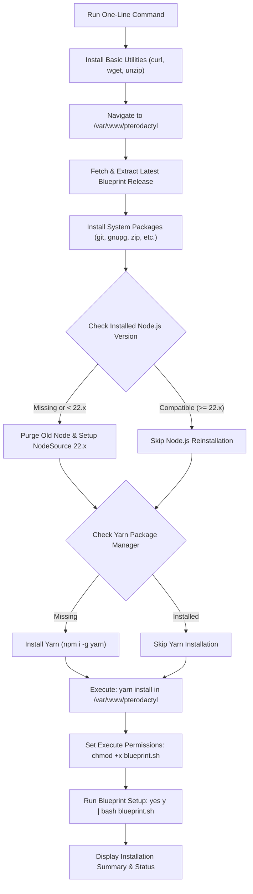

# Blueprint Installer for Pterodactyl

<p align="center">
  
</p>

<p align="center">
  <a href="https://github.com/Qanz4Ever/Blueprint-Installer/releases"></a>
  <a href="https://ubuntu.com/"></a>
  <a href="https://nodejs.org/"></a>
  <a href="https://pterodactyl.io/"></a>
  <a href="LICENSE"></a>
  <a href="https://github.com/Qanz4Ever"></a>
</p>

<p align="center">
  <a href="#-quick-installation">Quick Installation</a> •
  <a href="#-overview">Overview</a> •
  <a href="#-key-features">Key Features</a> •
  <a href="#-system-requirements">Requirements</a> •
  <a href="#-installation-workflow">How It Works</a> •
  <a href="#-licensing">Licensing</a> •
  <a href="#-author--support">Author</a>
</p>

---

## 🚀 Quick Installation

Run the complete, unattended Blueprint installation with a single command in your Linux terminal:

### ⚡ One-Line Command (Recommended)

```bash
bash <(curl -fsSL https://raw.githubusercontent.com/Qanz4Ever/Blueprint-Installer/main/blueprint-installer.sh)
```

> [!IMPORTANT]
> **Root Permissions Required**: Run this command directly as `root` or with an administrative user account (`sudo -i`).

> [!TIP]
> **Command Breakdown**:
> - `-f`: Fails silently on HTTP server errors.
> - `-s`: Silent mode (suppresses curl progress meters).
> - `-S`: Shows error messages if the transfer fails.
> - `-L`: Automatically follows URL redirects.
> - `bash <(...)`: Streams and executes the script directly in bash without saving residual temporary files.

<br>

### 🛡️ Alternative: Download, Review & Run

If you prefer inspecting scripts before running them on production systems:

```bash
# 1. Download the installation script
curl -fsSL https://raw.githubusercontent.com/Qanz4Ever/Blueprint-Installer/main/blueprint-installer.sh -o blueprint-installer.sh

# 2. Review script contents (optional)
less blueprint-installer.sh

# 3. Grant execute permissions and run as root
chmod +x blueprint-installer.sh
sudo ./blueprint-installer.sh
```

---

## 📌 Overview

**Blueprint Framework** is the industry-standard modular extension engine for **Pterodactyl Panel**, allowing administrators to install modifications, custom dashboard themes, and automated extensions seamlessly.

Manual installation typically requires multiple steps: installing system dependencies, verifying Node.js versions, updating APT sources, setting directory permissions, extracting archives, and managing Yarn dependencies.

**Blueprint Installer** automates the entire process into a seamless, **idempotent**, and **unattended** workflow. It detects your current environment, upgrades packages only when necessary, answers interactive prompts automatically, and displays a polished terminal UI with clear status indicators.

---

## ✨ Key Features

| Feature | Description |
| :--- | :--- |
| ⚡ **One-Line Deployment** | Fully automated zero-interaction installation from start to finish. |
| 📦 **Smart Node.js Auto-Resolver** | Checks your installed Node.js version. If $< 22$, cleanly cleans deprecated repos and installs Node.js 22.x LTS via official NodeSource. |
| 🧶 **Automatic Yarn Setup** | Automatically detects or installs Yarn package manager globally. |
| 🔄 **Idempotent & Safe Re-run** | Skips already installed tools and dependencies. Safe to re-run anytime. |
| 🤖 **100% Unattended Prompts** | Automatically feeds confirmation answers (`yes y`) so you don't have to monitor the terminal. |
| 🎨 **Polished Terminal Interface** | Styled with clear color-coded indicators (`✔ Ready`, `➜ SKIP`), framed header boxes, and readable step transitions. |
| 🛡️ **Pterodactyl Compliant** | Strictly respects the official Blueprint installation guidelines and file structure (`/var/www/pterodactyl`). |

---

## 🧱 System Requirements

Ensure your server meets the following specifications before running the installer:

| Component | Minimum Requirement | Recommended |
| :--- | :--- | :--- |
| **Operating System** | Ubuntu 20.04 LTS | Ubuntu 22.04 LTS / 24.04 LTS |
| **Pterodactyl Panel** | Pterodactyl Panel 1.x installed | `/var/www/pterodactyl` |
| **Privileges** | Root user or `sudo` access | `root` shell (`sudo -i`) |
| **Network** | Active internet connection | Outbound access to GitHub & NodeSource |
| **Architecture** | x86_64 / amd64 | x86_64 / amd64 |

---

## 🔄 Installation Workflow

The diagram below illustrates the exact execution pipeline performed by `blueprint-installer.sh`:



---

## 🖥️ Terminal UI Preview

When running, the installer delivers a structured, color-coded visual console:

```
────── ⋆⋅☆⋅⋆ ──────
╔══════════════════════════════════════╗
║ Blueprint Installer
╚══════════════════════════════════════╝
 Created by Mfsavana
 Clean • Automatic • Safe • Modern
────── ⋆⋅☆⋅⋆ ──────

[1/9] INSTALL BASIC TOOLS
✔ curl, wget, unzip ready

[2/9] SET PTERODACTYL DIRECTORY
✔ Directory set → /var/www/pterodactyl

[3/9] DOWNLOAD BLUEPRINT LATEST RELEASE
✔ Blueprint extracted

[4/9] CHECK NODE.JS (REQUIRED ≥ 22)
➜ SKIP: Node.js v22.12.0 already compatible

[5/9] RUN BLUEPRINT INSTALLER
✔ Blueprint installed successfully

────── ⋆⋅☆⋅⋆ ──────
╔══════════════════════════════════════╗
║ INSTALLATION COMPLETE
╚══════════════════════════════════════╝
 Directory : /var/www/pterodactyl
 Node      : v22.12.0
 NPM       : 10.9.0
 Yarn      : 1.22.22
────── ⋆⋅☆⋅⋆ ──────
```

---

## 🔐 Security & Licensing

This repository uses a **dual-licensing architecture**:

### 1. Open-Source Files — Apache License 2.0
General documentation, public configuration files, and open components are licensed under the **Apache License 2.0**. You are free to use, modify, and distribute these files under the terms outlined in [`LICENSE`](LICENSE).

### 2. Protected Proprietary Components — MFSAVANA SECURITY LICENSE v1.0
Specific sensitive scripts containing the author marker:
```
All Code Created By Mfsavana
```
are governed by the **MFSAVANA SECURITY LICENSE v1.0** (see [`LICENSE-MFSAVANA`](LICENSE-MFSAVANA)).

**Strictly Prohibited:**
- ❌ Unauthorized re-uploading, republishing, or mirroring of protected scripts.
- ❌ Commercial repackaging, selling, or charging for access to the installer.
- ❌ Removing or altering copyright headers, author identifiers, or license markers.
- ❌ Public redistribution of derived or modified installer code without written permission.

*These scripts are source-available for administrative inspection and execution, but are NOT open-source for unauthorized distribution.*

---

## ⚠️ Disclaimer

- This installer is an independent automation project developed by **MFSAVANA** and is **not** officially affiliated with or endorsed by the official Pterodactyl or Blueprint Framework teams.
- Always perform a full database and panel backup (`mysqldump` and `/var/www/pterodactyl` backup) before running any automated deployment tools on production servers.

---

## 👤 Author & Support

<p align="center">
  Developed with ❤️ by <a href="https://github.com/Qanz4Ever"><strong>MFSAVANA</strong> (@Qanz4Ever)</a>
</p>

<p align="center">
  <a href="https://github.com/Qanz4Ever"></a>
  <a href="https://pterodactyl-installer.mfsavana.my.id/"></a>
  <a href="mailto:mfsavana@gmail.com"></a>
</p>

<p align="center">
  &copy; 2026 MFSAVANA (@Qanz4Ever). All rights reserved.
</p>
